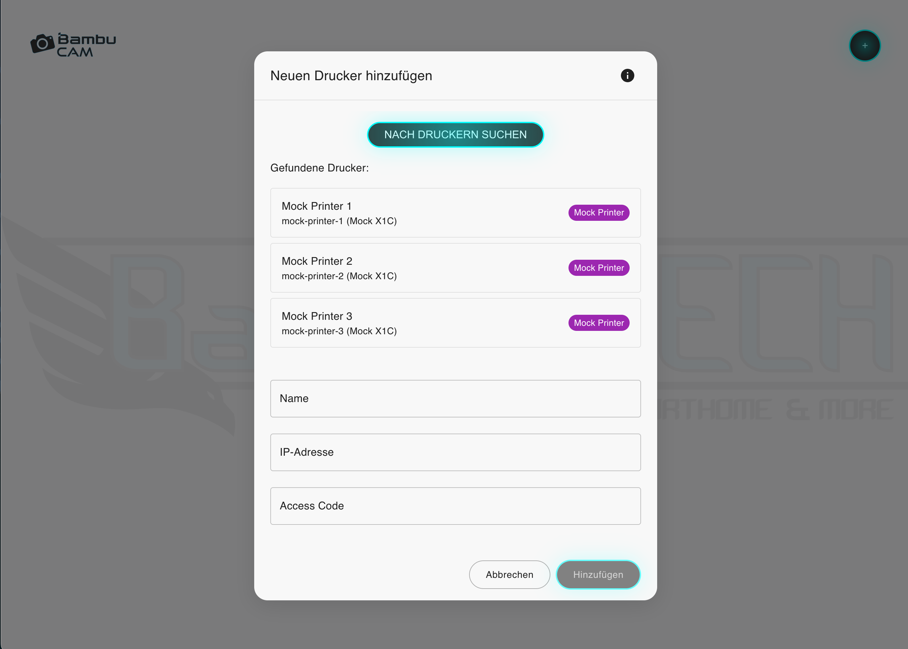

# BambuCAM


[](LICENSE)

<div align="center">
  
</div>

> 🎥 A modern web application for monitoring multiple 3D Printer (BambuLab X1C, Creality / Fluidd / Moonraker, OctoPrint) through their camera feeds

## Screenshots

  

_Left to right: Home screen, Add printer, Monitoring view with multiple printers_

## Table of Contents
- [What is BambuCAM?](#what-is-bambucam)
- [Features](#features)
- [Installation](#installation)
- [Requirements](#requirements)
- [Troubleshooting](#troubleshooting)
- [Support](#support)

## What is BambuCAM?
BambuCAM is a user-friendly web application for monitoring different 3D printers (Bambulab X1C, Creality / Moonraker, OctoPrint). It supports both local and cloud printers, offering enhanced video streaming through go2rtc integration and a clean, modern interface.

### Features
- 🎥 Enhanced live camera feeds with [go2rtc](https://github.com/AlexxIT/go2rtc) integration
- 🖱️ Drag & drop interface for camera arrangement
- 🖥️ Fullscreen mode for each printer
- ➕ Easy adding and removing of printers
- 🔄 Improved stream stability and auto-reconnection
- 🌐 Support for Bambu Cloud printers ( no videostreaming on Cloud Mode yet )
- 🔔 Status notifications and monitoring
- 🚀 Optimized performance with nginx
- 📱 Responsive design for all devices

## Installation

### 🐳 Quick Docker Installation

The fastest way to get started is using our pre-built Docker images:

1. Create a Folder: `sudo mkdir BambuCAM`
2. Jump into the folder: `cd BambuCAM`
3. Create a `docker-compose.yml`:
```yaml

services:
  frontend:
    image: bangertech/bambucam-frontend:latest
    restart: unless-stopped
    network_mode: "host"

  backend:
    image: bangertech/bambucam-backend:latest
    restart: unless-stopped
    volumes:
      - type: bind
        source: ./data
        target: /app/data
        bind:
          create_host_path: true
      - type: bind
        source: ./logs
        target: /app/logs
        bind:
          create_host_path: true
      - type: bind
        source: ./data/go2rtc
        target: /app/data/go2rtc
        bind:
          create_host_path: true
    environment:
      - LOG_LEVEL=DEBUG
    network_mode: "host"

  nginx:
    image: nginx:alpine
    network_mode: "host"
    restart: unless-stopped
    command: >
      /bin/sh -c "echo 'worker_processes auto;
      events {
        worker_connections 1024;
      }
      http {
        include /etc/nginx/mime.types;
        default_type application/octet-stream;
        sendfile on;
        keepalive_timeout 65;
        
        server {
          listen 80;
          
          location / {
            proxy_pass http://localhost:3000;
            proxy_http_version 1.1;
            proxy_set_header Upgrade $$http_upgrade;
            proxy_set_header Connection \"upgrade\";
            proxy_set_header Host $$host;
          }
          
          location /api {
            proxy_pass http://localhost:4000;
            proxy_http_version 1.1;
            proxy_set_header Host $$host;
          }
          
          location /go2rtc/ {
            proxy_pass http://localhost:1984/;
            proxy_http_version 1.1;
            proxy_set_header Upgrade $$http_upgrade;
            proxy_set_header Connection \"upgrade\";
            proxy_set_header Host $$host;
          }
        }
      }' > /etc/nginx/nginx.conf && nginx -g 'daemon off;'"
    depends_on:
      - frontend
      - backend
      - go2rtc

  go2rtc:
    image: alexxit/go2rtc
    container_name: go2rtc
    restart: unless-stopped
    network_mode: host
    volumes:
      - type: bind
        source: ./data/go2rtc
        target: /config
        bind:
          create_host_path: true
    environment:
      - GO2RTC_CONFIG=/config/go2rtc.yaml
      - GO2RTC_API=listen=:1984
      - GO2RTC_API_BASE=/go2rtc
      - GO2RTC_LOG_LEVEL=debug
    command: >
      /bin/sh -c "
      mkdir -p /config &&
      touch /config/go2rtc.yaml &&
      chmod 777 /config/go2rtc.yaml &&
      echo 'api:' > /config/go2rtc.yaml &&
      echo '  listen: :1984' >> /config/go2rtc.yaml &&
      echo '  base: /go2rtc' >> /config/go2rtc.yaml &&
      echo 'webrtc:' >> /config/go2rtc.yaml &&
      echo '  listen: :8555' >> /config/go2rtc.yaml &&
      echo 'rtsp:' >> /config/go2rtc.yaml &&
      echo '  listen: :8554' >> /config/go2rtc.yaml &&
      go2rtc
      "
    depends_on:
      - backend
```

4. Start BambuCAM:
```bash
docker compose up -d
```

That's it! The application will be available at http://localhost. Your data will be stored in the `./data` and `./logs` directories, making it easy to access and backup.

### Windows Users

For Windows users who prefer a guided installation:

#### 🚀 Quick Start

1. Download the [BambuCAM Installer](https://github.com/BangerTech/BambuCAM/releases/latest)
2. Run the installer as administrator
3. Open BambuCAM via desktop shortcut or at http://localhost

The installer will automatically:
- Install Docker Desktop if needed
- Configure WSL2 and port forwarding
- Pull the latest Docker images
- Create a desktop shortcut

#### 📋 System Requirements

- Windows 10/11
- 4 GB RAM
- 2 GB free disk space
- Available Ports:
  - 80 (Web Interface)
  - 1984 (go2rtc)
  - 4000 (Backend API)


#### 🔧 Uninstallation

1. Run `docker compose down` in the installation directory
2. Delete the folder `%LOCALAPPDATA%\BambuCAM`
3. Remove the desktop shortcut

#### ❓ Troubleshooting

If you encounter issues:
1. Make sure Docker Desktop is running
2. Check if port 3000 is not in use by another application
3. Open an issue on GitHub

### Method 3: Manual Installation (Linux)

For users who want to build from source:

#### Quick Start Installation
1. Clone repository:
```bash
git clone https://github.com/BangerTech/BambuCAM.git
cd BambuCAM
```

2. Start Docker Compose:
```bash
docker compose -f docker-compose.dev.yml up --build
```

3. Open in browser:
```bash
http://localhost:3000
```

## Printer Setup

### Requirements
- BambuLab printer (local network or cloud)
- Camera enabled in printer settings

### Adding a Printer
#### Local Printer
1. Click "Add Printer" in the app
2. Enter a name for the printer
3. Enter the printer's IP address
4. Enter Access Code (found in printer settings under "Network")
5. Click "Add"

#### Cloud Printer
1. Click "Add Printer" and select "Cloud Printer"
2. Log in with your Bambu Lab account
3. Select your printer from the list
4. Click "Add"

## Technologies
- React.js Frontend
- Node.js Backend
- Docker & Docker Compose
- go2rtc Stream Processing
- nginx Reverse Proxy

## Troubleshooting

If you cannot connect to the printer:
1. Check if the printer is powered on and connected to the network
2. Verify you are using the correct IP address
3. Verify the Access Code is correct
4. Check if "LAN Only Mode" is enabled
5. Restart the printer

## Support

For issues or questions, please create a [GitHub Issue](https://github.com/BangerTech/BambuCAM/issues).


## Sponsorship

<a href="https://www.paypal.com/cgi-bin/webscr?cmd=_s-xclick&hosted_button_id=FD26FHKRWS3US" target="_blank"></a>

## Keywords
`bambulab` `3d-printer` `camera-viewer` `monitoring` `docker` `react` `rtsp-stream` 
`printer-management` `web-interface` `live-stream` `temperature-monitoring` 
`print-progress` `open-source`

## Configuration

### Stream Settings
The stream quality is automatically optimized. For manual adjustments, you can edit the go2rtc configuration in `backend/data/go2rtc/go2rtc.yaml`.

### Network Configuration
Make sure the required ports (80, 1984, 4000) are available and not blocked by your firewall.